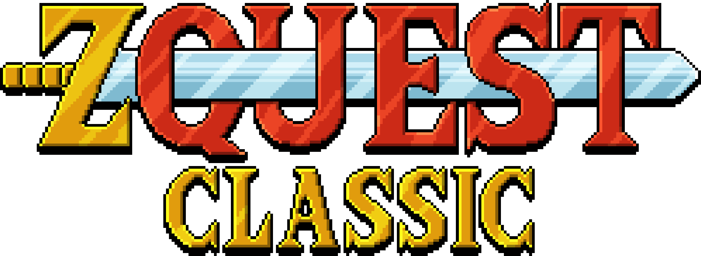

  

# ZQuest Classic

ZQuest Classic is a free, open source engine for making games similar to the original NES Zelda. Choose from hundreds of quests, or create your own.

Website: [zquestclassic.com](https://zquestclassic.com)

[Latest Releases](https://zquestclassic.com/releases/)

[How to Play](https://zquestclassic.com/docs/how-to-play/)

[Our Discord](https://discord.gg/uStAnHJhPM)

We support Windows (Win7+), OSX (12+), and Linux. There is also an experimental [web version](https://zquestclassic.com/play/) that can also be played on mobile devices.

## Development

See [`docs/building.md`](./docs/building.md) and learn [how to contribute](./CONTRIBUTING.md).

## Images

[See more on our website](https://zquestclassic.com/)

## License

GPLv3. See the [LICENSE](./LICENSE).
